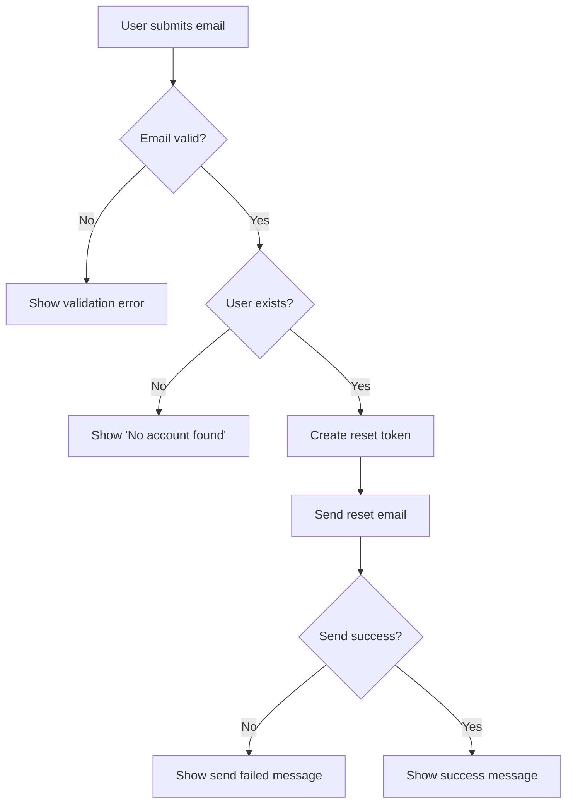
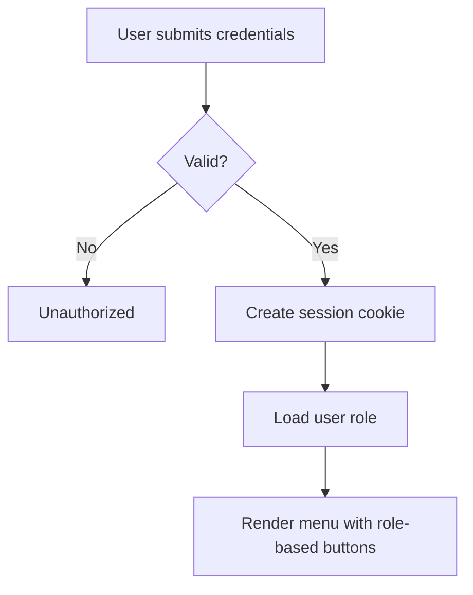

# Activity Diagrams

## Forgot Password Activity

```mermaid
flowchart TD
    A[User submits email] --> B{Email valid?}
    B -- No --> C[Show validation error]
    B -- Yes --> D{User exists?}
    D -- No --> E[Show 'No account found']
    D -- Yes --> F[Create reset token]
    F --> G[Send reset email]
    G --> H{Send success?}
    H -- No --> I[Show send failed message]
    H -- Yes --> J[Show success message]
```

## Login + Role Routing

```mermaid
flowchart TD
    A[User submits credentials] --> B{Valid?}
    B -- No --> C[Unauthorized]
    B -- Yes --> D[Create session cookie]
    D --> E[Load user role]
    E --> F[Render menu with role-based buttons]
```
