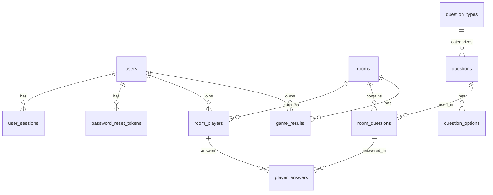

# ERD (Entity Relationship Diagram)

## Notes
- `users.role` stores authorization level: `User`, `Manager`, `Admin`.
- `room_players` is a linking table between users and rooms.
- `room_questions` links a game room to selected questions.
