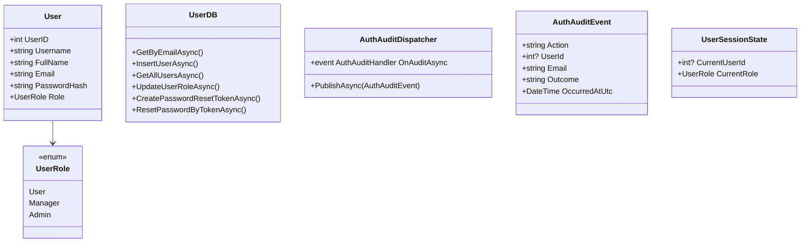

# UML (Core Classes)

```mermaid
classDiagram
    class User {
      +int UserID
      +string Username
      +string FullName
      +string Email
      +string PasswordHash
      +UserRole Role
    }

    class UserRole {
      <<enum>>
      User
      Manager
      Admin
    }

    class UserDB {
      +GetByEmailAsync()
      +InsertUserAsync()
      +GetAllUsersAsync()
      +UpdateUserRoleAsync()
      +CreatePasswordResetTokenAsync()
      +ResetPasswordByTokenAsync()
    }

    class AuthAuditDispatcher {
      +event AuthAuditHandler OnAuditAsync
      +PublishAsync(AuthAuditEvent)
    }

    class AuthAuditEvent {
      +string Action
      +int? UserId
      +string Email
      +string Outcome
      +DateTime OccurredAtUtc
    }

    class UserSessionState {
      +int? CurrentUserId
      +UserRole CurrentRole
    }

    User --> UserRole
```
